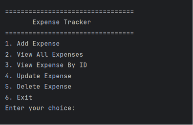
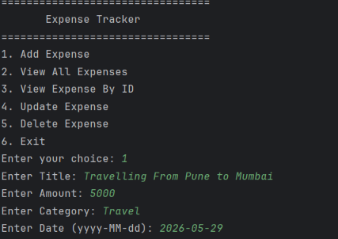
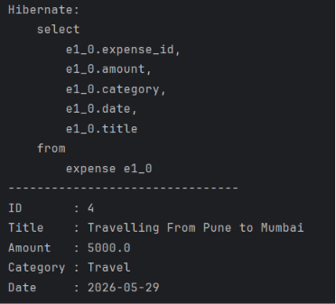
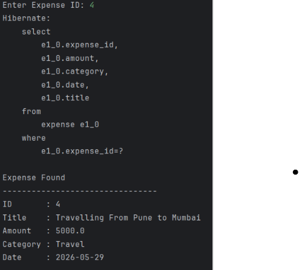
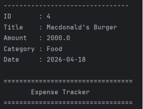
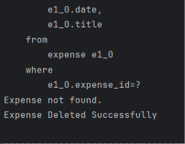
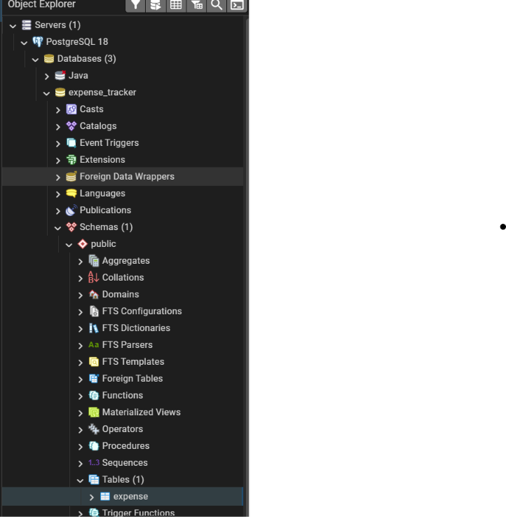

# 💰 Expense Tracker

A console-based Expense Tracker built using **Java**, **Hibernate ORM**, and **PostgreSQL**.

This project demonstrates CRUD operations using the DAO and Service Layer architecture.

---

## 🚀 Features

- ➕ Add Expense
- 📋 View All Expenses
- 🔍 View Expense By ID
- ✏️ Update Expense
- ❌ Delete Expense

---

## 🛠️ Tech Stack


---

## 📂 Project Structure

```text
Expense Tracker
│
├── entity
├── dao
├── service
├── util
└── main
```

---

## 🖥️ Application Menu


---

## ➕ Add Expense



---

## 📋 View All Expenses



---

## 🔍 View Expense By ID



---

## ✏️ Update Expense



---

## ❌ Delete Expense



---

## 🗄️ PostgreSQL Database



---

## 🏗️ Architecture

```text
User
 │
 ▼
Main (Console UI)
 │
 ▼
ExpenseService
 │
 ▼
ExpenseDAO
 │
 ▼
Hibernate ORM
 │
 ▼
PostgreSQL
```

---

## 📚 Concepts Covered

- Java OOP
- Hibernate ORM
- CRUD Operations
- DAO Pattern
- Service Layer
- PostgreSQL
- Transactions
- HQL

---

## ▶️ How to Run

1. Clone the repository.

```bash
git clone https://github.com/piyushbaghel29/Expense-Tracker.git
```

2. Open in IntelliJ IDEA.

3. Configure PostgreSQL credentials in:## Configuration

Update the following properties in `hibernate.cfg.xml` before running the project:

```xml
hibernate.connection.username
hibernate.connection.password
``````

4. Create the database

```sql
CREATE DATABASE expense_tracker;
```

5. Run

```
Main.java
```

---


## 👨‍💻 Author

**Piyush Baghel**

- GitHub: https://github.com/piyushbaghel29
- LinkedIn: https://www.linkedin.com/in/piyush-baghel-1353a620b/